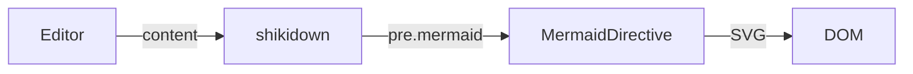

shikidown recognises ` ```mermaid ` fences natively — **no markdown-it plugin required**. Instead of
highlighting the fence, `MarkdownService` emits a placeholder:

```html
<pre class="mermaid" data-mermaid-src="…">graph TD…</pre>
```

Turning that placeholder into an SVG is the job of `MermaidDirective`, which lives in its own entry
point.

## Setup

<Steps>

<Step>

### Install mermaid

```bash
npm install mermaid
```

`mermaid` is an **optional** peer dependency (`>=11`).

</Step>

<Step>

### Add the directive

```typescript
import { MarkdownComponent } from 'shikidown';
import { MermaidDirective } from 'shikidown/mermaid';

@Component({
  selector: 'app-docs',
  imports: [MarkdownComponent, MermaidDirective],
  template: `<shikidown mermaid [content]="markdown" />`,
})
export class DocsComponent {
  readonly markdown = '```mermaid\ngraph TD\n  A[Start] --> B{Choice}\n```';
}
```

`MermaidDirective` has an attribute selector, `[mermaid]`, and takes no inputs.

</Step>

</Steps>

Without the directive, ` ```mermaid ` blocks stay rendered as inert code. That is a deliberate,
harmless fallback rather than an error.

## Why a separate entry point

`mermaid` is large, and most applications never draw a diagram. It is therefore reachable **only**
through `shikidown/mermaid`:

```typescript
import { MermaidDirective } from 'shikidown/mermaid'; // ← the only door
```

If you never import from that path, `mermaid` never enters your dependency graph. And even when you
do, the package itself is fetched with a dynamic `import('mermaid')` the first time the directive
runs — never during SSR, never before it is needed.

## How rendering is driven

The directive is **event-driven** rather than re-running on every change detection cycle. It
installs two `MutationObserver`s:

- one on its host element, watching for diagram placeholders newly inserted by shikidown — which is
  what makes it work with asynchronous and
  [incremental rendering](/docs/guides/incremental-rendering);
- one on `<html>`, watching the `class` attribute for a dark/light switch.

Work is coalesced through a microtask, so the burst of mutations mermaid itself produces while
drawing does not trigger a second pass. Nothing runs while nothing changes, and rendering is scoped
to the host element rather than the whole document.

## Dark mode

On a theme change the directive re-initialises mermaid with `theme: 'dark'` or `theme: 'default'`,
then rearms already-rendered diagrams by restoring their source from `data-mermaid-src` and clearing
`data-processed`. Diagrams are redrawn in the new theme without touching `[content]`.

The trigger is the `dark` class on `<html>` — the same convention used by
[Styling and dark mode](/docs/guides/styling-dark-mode).

## Security

<Callout type="warn">
  The directive initialises mermaid with `securityLevel: 'loose'`. That setting allows click
  handlers and raw HTML inside diagram labels — convenient for interactive diagrams, but it means a
  Mermaid source is as trusted as the rest of the Markdown. Do not render diagram definitions that
  came from untrusted users.
</Callout>

This is consistent with how the rest of the library treats its input; see
[Content security](/docs/guides/markdown-component#content-security).

## Example

````markdown

````

<Mermaid chart={`
flowchart LR
  Editor -->|content| shikidown
  shikidown -->|pre.mermaid| MermaidDirective
  MermaidDirective -->|SVG| DOM
`} />
