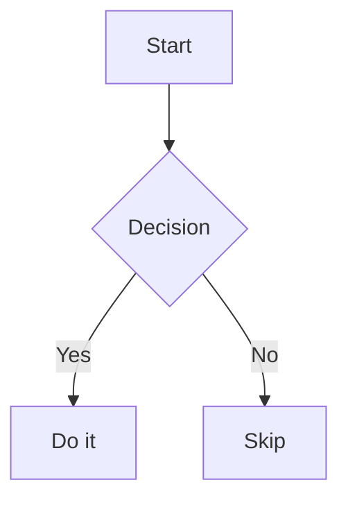

# shikidown

> Angular Markdown renderer with Shiki syntax highlighting, Angular component embedding, and incremental block rendering.

[](https://angular.dev)
[](https://shiki.style)
[](https://markdown-it.github.io)
[](LICENSE)

## What is shikidown?

**shikidown** is an Angular library that renders Markdown documents with:

- **[Shiki v4](https://shiki.style)** syntax highlighting — IDE-quality, dual dark/light theme via CSS variables
- **Angular components embedded by selector** — any component registered as a Custom Element can be placed directly in Markdown
- **Incremental block rendering** — only blocks whose source text changed are re-parsed; unchanged DOM nodes (including Web Component state) are preserved between keystrokes
- **`MarkdownComponent`**, **`MarkdownPipe`**, and **`MarkdownService`** — three integration points depending on your use case

---

## Table of contents

- [Installation](#installation)
- [Quick start](#quick-start)
- [Configuration](#configuration)
- [Plugins](#plugins)
- [MarkdownComponent](#markdowncomponent)
- [MarkdownPipe](#markdownpipe)
- [Embedding Angular components](#embedding-angular-components)
- [Incremental rendering](#incremental-rendering)
- [MarkdownService API](#markdownservice-api)
- [Styles & dark mode](#styles--dark-mode)
- [Exported types](#exported-types)
- [Project structure](#project-structure)

---

## Installation

```bash
npm install shikidown shiki markdown-it
npm install --save-dev @types/markdown-it
```

**Peer dependencies** (already present in any Angular 21 project):

| Package | Version |
|---------|---------|
| `@angular/core` | `^21.0.0` |
| `@angular/elements` | `^21.0.0` |
| `markdown-it` | `^14.0.0` |
| `shiki` | `^4.0.0` |

---

## Quick start

**1. Register the provider in `app.config.ts`:**

```typescript
import { provideMarkdown } from 'shikidown';

export const appConfig: ApplicationConfig = {
  providers: [
    provideMarkdown({
      theme: { dark: 'github-dark', light: 'catppuccin-latte' },
    }),
  ],
};
```

**2. Use the component in a template:**

```typescript
import { MarkdownComponent } from 'shikidown';

@Component({
  imports: [MarkdownComponent],
  template: `<shikidown [content]="md" class="prose dark:prose-invert max-w-none" />`,
})
export class MyComponent {
  readonly md = `# Hello\n\nThis is **shikidown**.`;
}
```

---

## Configuration

`provideMarkdown()` accepts a `MarkdownConfig` object:

```typescript
provideMarkdown({
  // Shiki theme — string or dark/light pair
  // Full intellisense: same type as createHighlighter({ themes })
  theme: { dark: 'github-dark', light: 'catppuccin-latte' },

  // Shiki languages to preload (intellisense matches createHighlighter({ langs }))
  languages: ['typescript', 'javascript', 'html', 'css', 'bash', 'json'],

  // Angular components to embed in Markdown, registered as Custom Elements
  components: {
    'my-alert': AlertComponent,
    'my-counter': CounterComponent,
  },

  // Additional markdown-it plugins
  plugins: [markdownItAnchor, markdownItFootnote],

  // Override markdown-it options (merged with defaults)
  markdownOptions: { breaks: true },

  // Incremental block rendering (default: false)
  incrementalRendering: true,

  // LRU block cache capacity (default: 256)
  blockCacheSize: 512,
})
```

### All options

| Property | Type | Default | Description |
|----------|------|---------|-------------|
| `theme` | `string \| { dark, light }` | `{ dark: 'github-dark', light: 'poimandres' }` | Shiki theme(s). A string uses the same theme for both modes. |
| `languages` | `StringLiteralUnion<BundledLanguage>[]` | 17 common languages¹ | Shiki languages to preload at startup. |
| `components` | `Record<string, Type<unknown>>` | `{}` | Angular components registered as Custom Elements. |
| `plugins` | `Array<(md: MarkdownIt) => void>` | `[]` | markdown-it plugins applied in order. See [Plugins](#plugins). |
| `markdownOptions` | `MarkdownItOptions` | — | markdown-it constructor options, merged with the library defaults (`html: true`, `linkify: true`, `typographer: true`). |
| `incrementalRendering` | `boolean` | `false` | Enable block-level incremental rendering in `MarkdownComponent`. Has no effect on `MarkdownPipe`. |
| `blockCacheSize` | `number` | `256` | Maximum number of rendered blocks kept in the LRU cache. |

> ¹ Default languages: `typescript`, `javascript`, `jsx`, `tsx`, `html`, `css`, `scss`, `json`, `yaml`, `bash`, `shell`, `markdown`, `sql`, `python`, `rust`, `go`.

---

## Plugins

shikidown exposes the full `markdown-it` instance to any plugin that follows the standard `(md: MarkdownIt) => void` signature. Pass an array of plugins to `provideMarkdown()` — they are applied in order, once, just before the first render.

### Installing a plugin

```bash
npm install markdown-it-anchor
npm install --save-dev @types/markdown-it-anchor   # if typings are available
```

```typescript
// app.config.ts
import { provideMarkdown } from 'shikidown';
import markdownItAnchor from 'markdown-it-anchor';
import markdownItFootnote from 'markdown-it-footnote';

export const appConfig: ApplicationConfig = {
  providers: [
    provideMarkdown({
      theme: { dark: 'github-dark', light: 'catppuccin-latte' },
      plugins: [markdownItAnchor, markdownItFootnote],
    }),
  ],
};
```

### Popular plugins

| Feature | Package | Install |
|---------|---------|---------|
| Heading anchors | [`markdown-it-anchor`](https://www.npmjs.com/package/markdown-it-anchor) | `npm i markdown-it-anchor` |
| Footnotes | [`markdown-it-footnote`](https://www.npmjs.com/package/markdown-it-footnote) | `npm i markdown-it-footnote` |
| Task lists | [`markdown-it-task-lists`](https://www.npmjs.com/package/markdown-it-task-lists) | `npm i markdown-it-task-lists` |
| LaTeX / KaTeX | [`@iktakahiro/markdown-it-katex`](https://www.npmjs.com/package/@iktakahiro/markdown-it-katex) | `npm i @iktakahiro/markdown-it-katex katex` |
| Mermaid diagrams | [`markdown-it-mermaid`](https://www.npmjs.com/package/markdown-it-mermaid) | `npm i markdown-it-mermaid` |
| Superscript / Subscript | [`markdown-it-sup`](https://www.npmjs.com/package/markdown-it-sup) / [`markdown-it-sub`](https://www.npmjs.com/package/markdown-it-sub) | `npm i markdown-it-sup markdown-it-sub` |
| `==highlight==` marks | [`markdown-it-mark`](https://www.npmjs.com/package/markdown-it-mark) | `npm i markdown-it-mark` |

### LaTeX rendering with KaTeX

```bash
npm install @iktakahiro/markdown-it-katex katex
```

```typescript
import markdownItKatex from '@iktakahiro/markdown-it-katex';

provideMarkdown({
  plugins: [markdownItKatex],
})
```

Add the KaTeX stylesheet to your `index.html` (or import it in `styles.css`):

```html
<link rel="stylesheet" href="https://cdn.jsdelivr.net/npm/katex/dist/katex.min.css" />
```

Inline math: `$E = mc^2$` — block math:

```markdown
$$
\int_0^\infty e^{-x^2} dx = \frac{\sqrt{\pi}}{2}
$$
```

### Mermaid diagrams

```bash
npm install markdown-it-mermaid
```

```typescript
import markdownItMermaid from 'markdown-it-mermaid';

provideMarkdown({
  plugins: [markdownItMermaid],
})
```

````markdown

````

### Writing a custom plugin

A plugin is any function that receives the `MarkdownIt` instance. You can add new rules, modify existing ones, or wrap the renderer:

```typescript
import type MarkdownIt from 'markdown-it';

function myPlugin(md: MarkdownIt): void {
  // Example: render ==text== as <mark>text</mark>
  md.core.ruler.push('mark', (state) => {
    for (const token of state.tokens) {
      if (token.type === 'inline' && token.children) {
        // ... transform token.children
      }
    }
  });
}

provideMarkdown({ plugins: [myPlugin] })
```

---

## MarkdownComponent

```html
<shikidown
  [content]="markdownString"
  class="prose prose-slate dark:prose-invert max-w-none"
/>
```

### Inputs

| Input | Type | Default | Description |
|-------|------|---------|-------------|
| `content` | `string` | `''` | Markdown source to render. |
| `components` | `Record<string, Type<unknown>>` | `{}` | Additional Angular components registered as Custom Elements for this instance only. Merged with those declared in `provideMarkdown()`. |

### Local component registration

Components passed via `[components]` are registered idempotently — `customElements.define()` is only called once per selector regardless of how many instances use it.

```html
<shikidown
  [content]="md"
  [components]="{ 'local-chart': ChartComponent }"
/>
```

---

## MarkdownPipe

Returns a `Signal<SafeHtml>` — call it as a function in the template:

```html
<!-- Simple -->
<div [innerHTML]="(markdownString | markdown)()"></div>

<!-- With @let -->
@let html = (markdownString | markdown)();
@if (html) {
  <div [innerHTML]="html"></div>
}
```

```typescript
import { MarkdownPipe } from 'shikidown';

@Component({
  imports: [MarkdownPipe],
  template: `<div [innerHTML]="(md | markdown)()"></div>`,
})
export class MyComponent {
  readonly md = '# Hello from the pipe';
}
```

> **Note:** `MarkdownPipe` does not support incremental rendering. Use `MarkdownComponent` with `incrementalRendering: true` for that feature.

---

## Embedding Angular components

Any component registered via `provideMarkdown({ components })` or the `[components]` input can be placed in Markdown using its CSS selector:

````markdown
# My document

Here is an interactive counter:

<my-counter initial-count="5" label="Votes"></my-counter>

And an alert:

<my-alert type="warning" title="Heads up" message="This is important."></my-alert>
````

Under the hood, shikidown uses **`@angular/elements`** — each component is wrapped in a standard Custom Element and registered with `customElements.define()`. The browser instantiates them when the rendered HTML is inserted into the DOM.

### Attribute → input mapping

HTML attributes are strings. The browser converts `kebab-case` attribute names to `camelCase` automatically when upgrading a Custom Element.

| HTML attribute | Angular `input()` |
|----------------|-------------------|
| `initial-count` | `initialCount` |
| `label` | `label` |
| `is-active` | `isActive` |

For numeric or boolean inputs, use Angular's built-in transform functions:

```typescript
import { numberAttribute, booleanAttribute } from '@angular/core';

@Component({ selector: 'my-counter' })
export class CounterComponent {
  readonly initialCount = input(0, { transform: numberAttribute });
  readonly disabled     = input(false, { transform: booleanAttribute });
}
```

### Global vs. local registration

| Method | Scope | When to use |
|--------|-------|-------------|
| `provideMarkdown({ components })` | Whole app | Components used across many pages |
| `[components]` input | Single `<shikidown>` instance | Page-specific or lazy-loaded components |

---

## Incremental rendering

When `incrementalRendering: true`, `MarkdownComponent` renders the document as a **list of independent root blocks** rather than a single HTML string.

### How it works

```
Content change
     │
     ▼
md.parse()  ──►  token grouping (depth-count)  ──►  blocks[]
                                                         │
                                     ┌───────────────────┘
                                     ▼
                          FNV-1a hash(block.source)
                                     │
                         ┌───────────┴────────────┐
                         │ hash in LRU cache?      │
                        yes                        no
                         │                         │
                   HTML reused               Shiki highlights
                         │                   result cached
                         └───────────┬────────────┘
                                     ▼
             @for (block of displayedBlocks; track block.hash)
                                     │
                         ┌───────────┴────────────┐
                         │ same SafeHtml ref?      │
                        yes                        no
                         │                         │
                  Angular skips              [innerHTML] updated
                  innerHTML write            → DOM replaced
```

### What is preserved between keystrokes

| | Without incremental | With incremental |
|-|---------------------|-----------------|
| Shiki re-highlighting | Every block, every time | Only changed blocks |
| DOM mutation | Full replacement | Only changed block nodes |
| Web Component state | Lost (counters reset) | Preserved in unchanged blocks |

### Clearing the cache

Call `MarkdownService.clearCache()` whenever you change the Shiki theme at runtime to force all blocks to be re-highlighted.

```typescript
import { MarkdownService } from 'shikidown';

@Component({ ... })
export class ThemeSwitcher {
  private readonly md = inject(MarkdownService);

  switchTheme(): void {
    // update your theme config...
    this.md.clearCache();
  }
}
```

---

## MarkdownService API

Inject `MarkdownService` directly for headless usage (SSR pre-rendering, custom pipes, etc.):

```typescript
import { MarkdownService, type RenderedBlock } from 'shikidown';

@Injectable({ providedIn: 'root' })
export class ContentService {
  private readonly md = inject(MarkdownService);

  async toHtml(markdown: string): Promise<string> {
    return this.md.parseAsync(markdown);
  }

  async toBlocks(markdown: string): Promise<RenderedBlock[]> {
    return this.md.parseBlocksAsync(markdown);
  }
}
```

### Methods

| Method | Signature | Description |
|--------|-----------|-------------|
| `initialize` | `() => Promise<void>` | Loads Shiki. Called automatically by all async methods. Safe to call multiple times. |
| `parseAsync` | `(content: string) => Promise<string>` | Renders the full Markdown document, returns raw HTML. |
| `parse` | `(content: string) => string` | Synchronous render. Throws if called before `initialize()` resolves. |
| `parseBlocksAsync` | `(content: string) => Promise<RenderedBlock[]>` | Renders as independent blocks with LRU caching. Used internally by `MarkdownComponent` in incremental mode. |
| `clearCache` | `() => void` | Empties the block LRU cache. |

---

## Styles & dark mode

`shikidown` ships **no default styles** — bring your own typography. The recommended approach is [Tailwind CSS Typography](https://github.com/tailwindlabs/tailwindcss-typography):

```html
<shikidown
  [content]="md"
  class="prose prose-slate dark:prose-invert max-w-none"
/>
```

### Setting up dark mode

Configure Tailwind v4 with a class-based `dark` variant and add the Shiki overrides:

```css
/* styles.css */
@import "tailwindcss";
@plugin "@tailwindcss/typography";

/* Class-based dark mode — toggle .dark on <html> */
@custom-variant dark (&:where(.dark, .dark *));

/* Shiki dual-theme: light theme is applied inline by Shiki (style="color:#xyz").
   Dark theme values live in --shiki-dark-* variables — activate them in dark mode. */
.dark .shiki {
  background-color: var(--shiki-dark-bg) !important;
}
.dark .shiki span {
  color: var(--shiki-dark) !important;
  font-style: var(--shiki-dark-font-style) !important;
  font-weight: var(--shiki-dark-font-weight) !important;
  text-decoration: var(--shiki-dark-text-decoration) !important;
}
```

> **Why `!important`?** Shiki applies light-theme colors as inline `style` attributes, which have the highest CSS specificity. `!important` is the only way to override them with the `--shiki-dark-*` CSS variables.

### Flash-free dark mode on load

Add this inline script before your app bundle to apply the saved preference before first paint:

```html
<script>
  (function () {
    const stored = localStorage.getItem('dark');
    const prefersDark = stored === 'true'
      || (stored === null && window.matchMedia('(prefers-color-scheme: dark)').matches);
    if (prefersDark) document.documentElement.classList.add('dark');
  })();
</script>
```

---

## Exported types

```typescript
import type {
  MarkdownConfig,      // Full configuration object for provideMarkdown()
  MarkdownThemePair,   // { dark: StringLiteralUnion<BundledTheme>; light: StringLiteralUnion<BundledTheme> }
  ParsedBlock,         // { hash, startLine, endLine, tokens, source }
  RenderedBlock,       // { hash: string; html: string }
} from 'shikidown';
```

---

## Project structure

```
markdown-shiki-renderer/
├── projects/
│   └── shikidown/               # Library source (ng-packagr)
│       └── src/
│           └── lib/
│               ├── markdown.component.ts   # <shikidown> component
│               ├── markdown.pipe.ts        # markdown pipe
│               ├── markdown.service.ts     # parsing, Shiki init, LRU cache
│               ├── markdown.provider.ts    # provideMarkdown() + registerAsCustomElement()
│               ├── markdown.config.ts      # MarkdownConfig interface
│               ├── markdown.tokens.ts      # MARKDOWN_CONFIG injection token
│               └── markdown.types.ts       # ParsedBlock, RenderedBlock, hashSource
└── src/                         # Demo application
    ├── pages/
    │   ├── home/                # Landing page
    │   ├── guide/               # Full documentation (FR / EN)
    │   ├── playground/          # Live Markdown editor
    │   └── components/          # Demo component showcase
    ├── components/
    │   ├── navbar/              # Navigation + dark mode + language toggle
    │   ├── demo-counter/        # Stateful counter Web Component
    │   ├── demo-alert/          # Alert Web Component
    │   └── demo-badge/          # Badge Web Component
    └── services/
        └── language.service.ts  # FR/EN language signal
```

---

## License

MIT
